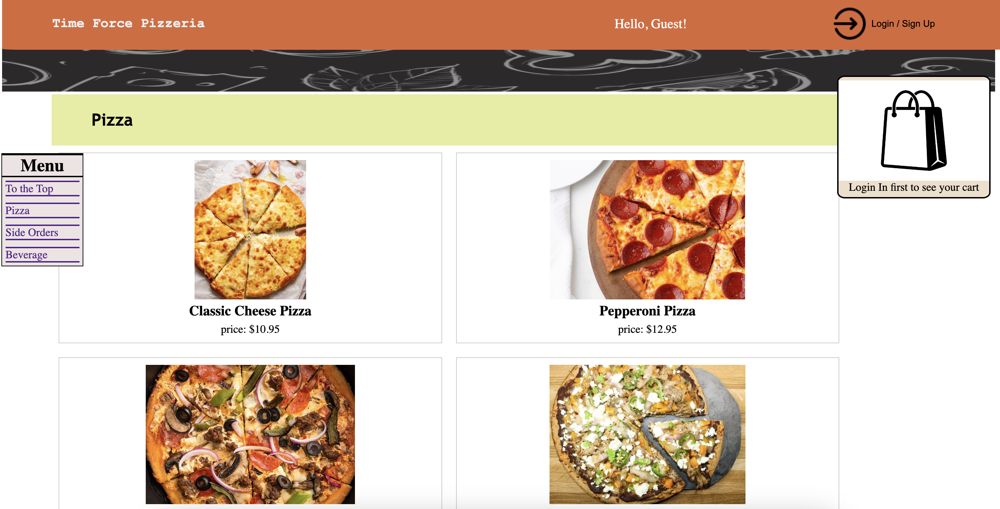

# Time Force Pizzeria

## Description

The Time Force Pizzeria is a Mighty Morphin' Pizzeria that offers a seamless platform for customers to explore our menu, place orders, and enjoy delicious pizzas delivered right to their doorstep.

### Future Development --
With only the basics for now, Stripe functionality is to be added to allow for payment to be made online as the order is processed. Other future features include things such as customizable options on pizza and side orders, and a favorites tab for users' favorite items on the menu. Users will also be able to leave reviews for any items they've ordered in the past. 

## Table of Contents

- [User Story](#user-story)
- [Project Requirements](#project-requirements)
- [Installation](#installation)
- [Usage](#usage)
- [Technologies Used](#technologies-used)
- [License](#license)
- [Credits](#credits)

## User Story

AS A pizzeria owner 
I WANT a website that allows my patrons to order food with their own personal account 
SO THAT they have easy reordering as well as being being able to keep track of their past purchases and dollar amount spent.

## Project Requirements

* Use React for the front end.

* Use GraphQL with a Node.js and Express.js server.

* Use MongoDB and the Mongoose ODM for the database.

* Use queries and mutations for retrieving, adding, updating, and deleting data.

* Be deployed using Heroku (with data).

* Have a polished UI.

* Be responsive.

* Be interactive (i.e., accept and respond to user input).

* Include authentication (JWT).

* Protect sensitive API key information on the server.

* Have a clean repository that meets quality coding standards (file structure, naming conventions, best practices for class and id naming conventions, indentation, high-quality comments, etc.).

* Have a high-quality README (with unique name, description, technologies used, screenshot, and link to deployed application).

## Installation

GitHub Repo - https://github.com/asierra619/time-force

Clone the repo 
Run the following commands in the integrated terminal - 
- `npm run install` 
- `npm run seed` 
- `npm run develop`  

## Usage

Check out our Website! 
https://time-force-pizza.onrender.com

Check out the [Installation](#installation) tab if you'd like to run the site locally.

## Technologies Used

Express, React, graphQL, Apollo, Atlas and Mongoose, Vite, bcrypt, dotenv, nodemon, and Stripe to be added

## License

MIT

## Credits

Tabitha Buder - https://github.com/MarshPupp 
Ulises Duran - https://github.com/ulisesd15 
Yilun Fan - https://github.com/ylf456 
Alex Sierra - https://github.com/asierra619 

Thank you to the following - 
Michael Pacheco 
Nirav Venkatesan 
Bobbi Tarkany - Calendly Tutor 
